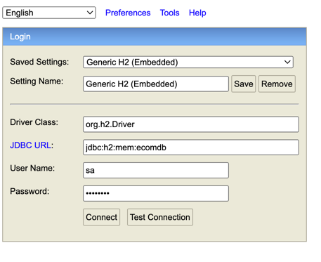

# Ecom Backend - Hands on repository

### Cloning the repository

```bash
git clone https://github.com/thoughtworks-hands-on/ecom-backend.git
```
### Install java 17 using sdkman
* Download sdkman with the following curl command
```bash
curl -s "https://get.sdkman.io" | bash
source "$HOME/.sdkman/bin/sdkman-init.sh"
sdk list java
sdk install java 17.0.7-amzn
sdk use java 17.0.7-amzn
```

### Setting up java runtime on intellij
* Open the project in Intellij
* Go to File -> Project Structure -> Project Settings -> Project -> Project SDK -> Select the java 17 sdk
* Set up the module sdk in project settings to 17 as well
* Set up the gradle jvm version to 17 in Settings -> Build, Execution, Deployment -> Build Tools -> Gradle -> Gradle JVM to 17

### Running the application
* Run the main method in EcomBackendApplication.java or using the command
```
./gradlew bootRun
```

### Running the tests
* Run the tests using the gradle command
```
./gradlew test
```

### Viewing the H2 database from the console
#### Note: H2 database is an in memory database that will be reset every time the application is restarted
* After starting the application, we can navigate to `http://localhost:8080/h2-console`, which will present us with a login page.
* Console will look like this

* Type in the password as `password` and click on connect
* We can now view the tables and run queries on the database

### Using the Collection to test the APIs
* If you are familiar with Insomnia, collection can be found as [ecom-Insomnia_collection.json](src/main/resources/collections/ecom-Insomnia_collection.json)
* If you are comfortable with postman, collection can be found as [ecom-Postman_collection.json](src/main/resources/collections/ecom.postman_collection.json)
